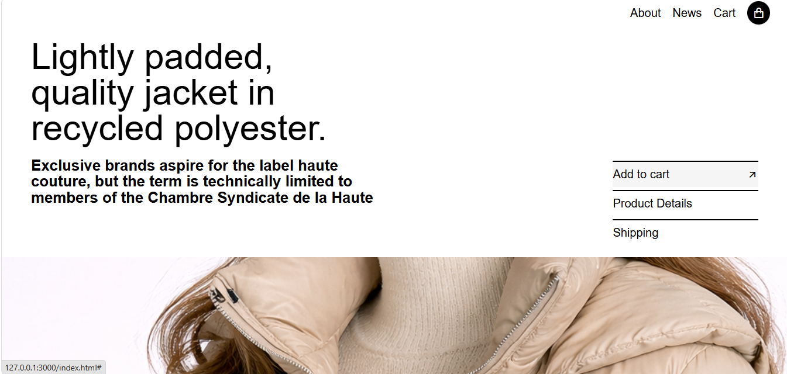
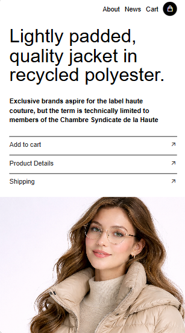

# Fashion Jacket Landing Page

This is a modern and responsive fashion product landing page built using HTML and CSS.
The project focuses on clean UI design, responsive layouts, typography hierarchy, and interactive hover effects.

## Features

* Fully responsive layout
* Modern fashion-inspired UI
* Interactive hover effects
* Clean typography and spacing
* Mobile-friendly design
* Minimal and aesthetic layout

## Technologies Used

* HTML5
* CSS3
* Remix Icons
* Git & GitHub

## Folder Structure

```bash
fashion-jacket-landing-page/
├── index.html
├── style.css
├── README.md
│
├── Images/
│   ├── Image.png
│   ├── desktop-preview.png
│   └── mobile-preview.png
```

## Screenshots

### Desktop View



### Mobile Responsive View



## How to Run

1. Clone the repository:

```bash
git clone https://github.com/kenil948/fashion-jacket-landing-page.git
```

2. Open `index.html` in your browser.

## Live Demo

Check it out here:
https://kenil948.github.io/fashion-jacket-landing-page/

## What I Learned

* Responsive Web Design
* CSS Flexbox Layout
* Typography Hierarchy
* Hover Interactions
* Media Queries
* UI Structuring
* GitHub Project Deployment

## Notes

This is a frontend practice project created for improving UI/UX and responsive web development skills.
